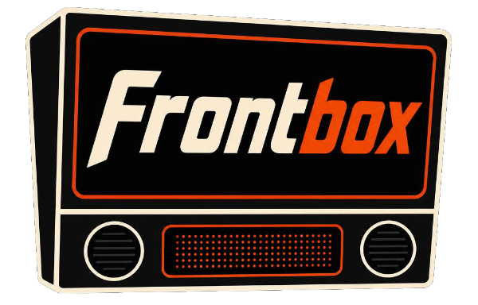

## Overview

Frontbox is a homebrew arcade framework built for [FAST Pinball](https://fastpinball.com/) hardware, designed around an actor-like constructs called "Systems", which send and receive signal.

> [!WARNING]
> Frontbox is in active, pre-release development with unstable APIs

### Features

- **Lightweight**: Built in [Rust](https://rust-lang.org/) to run on minimal hardware
- **Flexible**: All hardware can be referenced in 3 ways: by name, tag, or location in space
- **Dynamic**: Flexible animation + LED support out of the box
- **Retro**: Pin2DMD and NeoSeg\* (alpha numeric) display support out of the box
- **Sonically Immersive**: Sound system with preloading and automatic music ducking\*

\* = Coming Soon

## Guides

- App -- Booting things up
- Hardware -- Defining what exists
- Systems -- The behavorial unit everything happens within
- Drivers -- Turning things like coils on and off
- Switches -- Capturing input
- LEDs -- Lighting things up
- DMD -- Dot matrix display rendering

---


##### Fill Types

- **Pattern** - Defines an optionally repeating, fixed pattern. e.g. "red, white, blue three times"
- **Gradient** - Defines a linear fade between N colors

```rust
/// red, white, and blue, three times
ColorSequence::pattern(vec![Rgba::red(), Rgba::white(), Rgba::blue()], Cycle::Times(3));

// multi-gradient
ColorSequence::gradient(vec![
  GradientStop::new(Rgba::red(), Extent::zero()),
  GradientStop::new(Rgba::magenta(), Extent::relative(0.35)),
  GradientStop::new(Rgba::blue(), Extent::full()),
])
```

A handful of convenience construction methods are provided as well:

```rust
// 2 point gradient
ColorSequence::fade(Rgba::red(), Rgba::blue())

// Single pixel forever repeating pattern
ColorSequence::solid(Rgba::red(), Rgba::blue())

// Forever repeating pattern
ColorSequence::tile(vec![Rgba::red(), Rgba::white()])

// Three point gradient with given color as the center point, and hue arc of the given degrees
// This produces a red to orange to yellow gradient
ColorSequence::analogous(Rgba::orange(), 60.0)

// Three point gradient with the given lightness range, with the given color as the center point
// This produces a pink to red to dark red gradient
ColorSequence::monochromatic(Rgba::red(), 0.8)
```

#### Fill Area

Color sequence fills can also be offset or length-constrained and aligned.

```rust
// skip the outer 2 pixels
let seq = ColorSequence::solid(Rgba::red())
  .padded(Extent::absolute(1), Extent:: absolute(1));
let colors = seq.generate(3);
// Result: vec![Rgba::default(), Rgba::red(), Rgba::default()]

// render only half of the total length, center-aligned
let seq = ColorSequence::solid(Rgba::red())
  .anchored(Anchor::Center, Extent::relative(0.5));
let colors = seq.generate(4);
// Result: vec![Rgba::default(), Rgba::red(), Rgba::red(), Rgba::default()]
```

Modifying the fill area is useful for creating progress bar-like effects.

```rust
// red to blue gradient progress bar, left aligned
let seq = ColorSequence::fade(Rgba::red(), Rgba::blue())
  .anchored(Anchor::Left, Extent::relative(percent_complete));
```

#### Color Sequence Alterations

Alterations are chained onto a ColorSequence by way of `modify`.

```rust
let seq = ColorSequence::fade(Rgba::purple(), Rgba::white())
  .modify(Modification::rotated(180.0));
```

##### Alterations

- **Reversed** - Applies color sequence in opposite order
- **Rotated** - Positive degree shifts clockwise, negative degree shifts counter-clockwise
- **Shuffle** - Randomly re-order sequence
- **InnerFill** - Over-write base fill with a child fill

InnerFill can also be used to apply a masking effect, removing some pixels from the sequence.

```rust
let seq = ColorSequence::solid(Rgba::purple())
  .modify(Modification::transparent_at(Extent::absolute(1)));
let colors = seq.generate(3);
// Result: vec![Rgba::red(), Rgba::default(), Rgba::red()]
```

### LEDs

#### Modulators

A modulator combines an accumulator with a setter, mutating a value over time. Like accumulators, these can be used direct if needed, but are generally used through higher level constructors (like LedEffects).

```rust
let modulator = Modulator::new(
  self.anim,
  |value| {  }
)
```

#### LED Animations (Manual)

LEDs colors can of course be combined with animations. This works by accumulating the animation _and_ re-declaring the LED on the same tick.

```rust
pub struct AnimExample {
  anim: Tween<Duration, Color>
}

impl System for AnimExample {
  fn on_tick(&mut self, delta: Duration, ctx: &Context) {
    self.anim.accumulate(delta);

    // re-declaring the same LED will overwrite the previous declaration
    ctx.declare_leds(
      // declare the current animated value as the color of that LED
      &leds::EXAMPLE.q(), ColorSequence::solid(self.anim.sample())
    )
  }
}
```

Any declarable attribute is animatable. For example, a common technique with pinball machines that have 3 or more LEDs for a lane is to use those LEDs to animate a pointing motion. This could be achieved by creating a group of all lane LEDs, then turning one of them on, and animation which one is lit. By giving the declaration a higher z-index, the state of the lane indicators below remains the same, but the animated effect applies "over top of" it.

```rust
pub struct AnimExample {
  // notice the value being animated is a u8, not Color
  anim: Tween<Duration, u8>
}

impl System for AnimExample {
  fn on_tick(&mut self, delta: Duration, ctx: &Context) {
    self.anim.accumulate(delta);

    ctx.declare_leds(
      vec![&leds::LEFT_LANE_ARROW.q(), &leds::LEFT_LANE1.q(), &leds::LEFT_LANE2.q()].at_z(2),
      ColorSequence::pattern(self.anim.sample(), vec![Rgba::red()])
    )
  }
}
```

#### LED Animations (Effects)

A simpler want to manage LED animations is through modulations. A modulation combines an animation with a lens-style setter.

### Sounds

Frontbox includes `SoundSystem` that supports three types of sounds:

##### Effects

- Must be preloaded
- Can play unlimited at a time

##### Callouts

- Must be preloaded
- Can play one at a time
- Overlapping requests will queue
- Automatically lowers volume on music track when playing

##### Music

- Stream from disk
- Can only play one at a time
- Overlapping requests overwrite previous track
- Can crossfade into each other

```rust
let sound_system = ctx.systems.expect::<SoundSystem>();

// typically done `on_startup`
sound_system.preload("name", "/game/assets/sfx/example.wav");
sound_system.preload("multiball", "/game/assets/callouts/multiball.wav");

sound_system.play_sfx("name");
sound_system.play_callout("multiball");
sound_system.play_music("/game/assets/music/track1.mp3");
sound_system.crossfade_music("/game/assets/music/track2.mp3");
```

> [!WARNING]
> This is an evolving feature

### Operator Config

Operator config provides a standard way to read operator-level settings and provide structure to build a menu. Operator configs mainly show up in two places: (1) when declaring hardware properties (e.g. the power of a coil) and (2) for use by systems.

#### Configurable Hardware Values

Many hardware settings actually require a `HardwareValue`. For static values that remain for the life of the program, `HardwareValue::fixed` supports this. But for values that can be configured by the operator config, `HardwareValue::config` will make the value configurable.

```rust
hardware_defs! {
  pub MY_COIL: DriverDefinition = DriverDefinition::new("my_coil")
    .mode(PulseMode {
      trigger_mode: DriverTriggerMode::VirtualSwitchTrue,
      // static value for the life of the program
      initial_pwm_length: HardwareValue::fixed(Duration::from_millis(250)),
      // configurable value that can be adjusted via operator config
      initial_pwm_power: HardwareValue::config(
        "coil_power",  // name
        Power::THREE_QUARTERS // default
        Ranges::power(0.5, 1.0), // domain
      ),
      ..Default::default()
    });
}
```

#### System Config Values

Systems can also register operator config values independent of hardware (e.g. ball count, max extra balls, etc.). This is done through the `config_values` method of `System`.

```rust
pub static MAX_EXTRA_BALLS: LazyLock<ConfigValue<u8, Range<u8>>> = LazyLock::new(|| {
  ConfigValue::new(
    "Max Extra Balls", // name
    "The most extra balls a player can have per game", // description
    5, // default
    Ranges::u8(0, 10),
  )
});

impl System for Example {
  fn config_values(&self) -> Vec<&'static dyn LoadableConfigValue> {
    vec![&*MAX_EXTRA_BALLS]
  }
}
```

#### System Config Registration

- Startup systems have their config values automatically registered
- Dynamically loaded systems must be manually registered

```rust
  App::boot(BootConfig::default()).await
    .configure(|app| {
      // config values will be automatically registered
      app.system(MySystem::new())

      // manually register configs on a system
      app.register_configs(some_system)

      // or manually register explicit configs
      app.register_configs(vec![MY_CONFIG1, MY_CONFIG2])
    })
```

#### Reading Operator Configs

```rust
// The value is always present since a default is provided
let value: u8 = ctx.operator_config.get(MAX_EXTRA_BALLS);
```


#### Hardware Definition

##### I/O Network

The I/O network is defined using the `IoNetworkBuilder`. See [Defining Hardware]() guide for more details. I/O network devices can either associate a name with a pin, or can optionally provide a configuration. Configurations given here are automatically applied at startup.

Hardware is defined on a board by specifying it's pin, `switch(3)` and giving it a name `switch(3).named("foo")`. It is a good idea to declare names as constants, wrapped in a module for easy access.

Hardware can also be tagged `.tagged(Playfield)`. This serves to _classify_ something about the switch, possibly location or purpose. This makes it easy to implement modes that need to say things like "if any playfield switch has been hit, then...". These tags are arbitrary. Frontbox comes with several, but they can be user-defined as well.

Lastly, depending on the type of hardware being defined, an optional config (`.config(...)`) or mode (`.mode(...)`) can be given.

```rust
// Step 1. Define hardware

pub mod hw {
  use super::*;

  pub left_inlane_switch: SwitchDefinition = SwitchDefinition::new("linlane")
    .tag(Playfield);

  pub left_outlane_switch: SwitchDefinition = SwitchDefinition::new("loutlane")
    .tag(Playfield)
    .tag(Drain)
    .inverted()
    .debounce_open(Duration::from_millis(40));

  pub trough_eject_coil: DriverDefinition = DriverDefinition::new("trough_eject").build();

  pub shooter_coil: DriverDefinition = DriverDefinition::new("shooter")
    .tag(AutoPlungeCoil)
    .mode(PulseMode {
      trigger_mode: DriverTriggerMode::VirtualSwitchTrue,
      initial_pwm_power: Power::FULL,
      ..Default::default()
    });
}

// Step 2. Define and wire the network
//
// NOTE: order matters here. Boards must be listed in the order they appear on the network
// e.g. Neuron => IO3208 => IO1616 => Neuron would be defined as:

let io_network = IoNetwork::new(vec![
  IoBoards::io_3208()
    .wire_switch(3, &hw::left_inlane)
    .wire_switch(4, &hw::left_outlane)
    .wire_driver(0, &hw::trough_eject_coil)
    .wire_driver(1, &hw::shooter_coil),
  IoBoards::io_1616(),
]);
```

##### Expansion Network

The expansion network is defined using the `ExpansionNetworkBuilder`. See [Defining Hardware]() guide for more details.

```rust
// Step 1. Define exp devices

pub mod leds {
  use super::*;

  hardware_defs! {
    pub LEFT_INLANE: LedDefinition = LedDefinition::single("linlane")
      .location(Vec2::new(3.4, 32.5).relative_to(PLAYFIELD))
      .channels(ColorChannels::GRBW);

    pub LEFT_OUTLANE: LedDefinition = LedDefinition::new("loutlane")
      .location(Vec2::new(2.125, 32.5).relative_to(PLAYFIELD));

    // Cabinet lighting along the left art blade area
    pub LEFT_CAB_STRIP: LedDefinition = LedDefinition::strip("lcab", 32)
      .tag(Cabinet)
      .locations(CabinetLeft, 15.0, (10.25, 0), (48.5, 3.0));
  }
}

// Step 2. Define boards and wire the network

let exp_network = ExpansionNetwork::new(vec![
  ExpansionBoard::fp_exp0061()
    .wire_led_port(0, LedPort::ws2812b().leds(vec![
        &leds::LEFT_INLANE,
        &leds::LEFT_OUTLANE,
      ]
    )),
    .wire_led_port(1, LedPort::wS2812b().leds(vec![&leds::LEFT_CAB_STRIP]))
]);
```


### Tagging & Querying Hardware


## Complete Example System

This system implements a basic pinball "mode". A target is illuminated and must be struck 3 times. Each hit grants 1000 points. After 3 hits, the target will begin flashing. The player has 20 seconds to hit it again for 25,000 points (hurry up shot). After 20 seconds or being hit a 4th time the mode resets.

- `SwitchClosed` event monitors the target's switch
- `ctx.set_timer` and `TimerComplete` event monitors the hurry up timer
- `self.hurry_up_active` and `self.hits` manage state
- `fn leds` sets the LED state for the framework to apply (declarative)

```rust
const HURRY_UP_TIMER: &'static str = "hurry_up";

struct TargetHitter {
  // current times this target has been hit
  hits: u8,
  // animation for bonus hit
  flash_anim: Box<dyn Animation<Color>>,
  state: TargetHitterState,
  // ids for target switch and LED indicator
  target_switch_id: &'static str,
  indicator_id: &'static str,
}

enum TargetHitterState {
  // waiting to get to the desired number of hits
  Building,
  // bonus hurry-up mode for extra points
  HurryUp
}

impl TargetHitter {
  pub fn new(target_switch_id: &'static str, indicator_id: &'static str) -> Box<Self> {
    Box::new(Self {
      target_switch_id,
      indicator_id,
      hits: 0,
      state: TargetHitterState::Building,
      flash_anim: InterpolationAnimation::new(
        Duration::from_millis(450),
        Curve::ExponentialInOut,
        vec![Rgba::black(), Rgba::red()],
        Cycle::Forever,
      )
    })
  }

  fn reset(&mut self) {
    self.hits = 0;
    self.hurry_up_active = false;
    self.flash_anim.reset();
  }

  // Here's what happens when the target is it -- if the mode is in "hurry up"
  fn on_target_hit(&mut self, ctx: &Context) {
    let game_manager = ctx.systems.expect::<GameManager>();

    match self.state {
      TargetHitterState::HurryUp => {
        game_manager.add_points(25_000, ctx);
        self.on_hurry_up_done();
      }
      TargetHitterState::Building => {
        self.hits = self.hits.saturating_add(1);
        game_manager.add_points(1000, ctx);

        if self.hits == 3 {
          self.hurry_up_active = true;
          cmds.set_timer(HURRY_UP_TIMER, Duration::from_secs(20), TimerMode::Once);
        }
      }
    }
  }

  fn on_hurry_up_done(&mut self) {
    self.reset();
  }
}

impl System for TargetHitter {
  fn on_event(&mut self, event: &dyn Signal, ctx: &Context) {
    if let Some(event) = event.downcast::<SwitchClosed>() {
      if event.switch.id == self.target_switch_id {
        self.on_target_hit(ctx);
      }
    }
  }

  fn on_timer(&mut self, name: &'static str, _ctx: &mut Context) {
    if event.name == HURRY_UP_TIMER {
      self.on_hurry_up_done();
    }
  }

  fn leds(&mut self, delta_time: Duration, _ctx: &Context) -> LedStates {
    // show the flashing state if hurry up is active otherwise use a static color
    match self.state {
      TargetHitterState::HurryUp => {
        LedDeclarationBuilder::new(delta_time)
          .next_frame(self.flash_anim)
          .collect()
      }
      TargetHitterState::Building => {
        let color = match self.hits {
          0 => Rgba::yellow(),
          1 => Rgba::orange(),
          2 => Rgba::red(),
        }
        LedDeclarationBuilder::new(delta_time)
          .on(self.indicator_id, color)
          .collect()
      }
    }
  }
}
```

See [examples](frontbox/examples) or the [included plugins](frontbox-rs/tree/main/frontbox-turn-based/src) for more.

### AI Usage

This project generally follows the [Rust language LLM use policy](https://forge.rust-lang.org/policies/llm-usage.html).

- It’s fine to use LLMs to answer questions, analyze, distill, refine, check, suggest, review. But not to **create**.
- LLMs work best when used as a tool to write _better_, not _faster_.

**Design ("style") should be human-driven.** Frontbox is not "vibe-coded".
